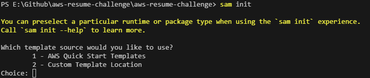
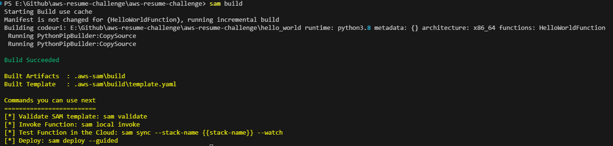

## Setting up s3 

- What is s3 ?
- What is AWS SAM ? 
   - Will create us an AWS Lambda function  (we will ignore for now)

- Setup the SAM  CLI (https://docs.aws.amazon.com/serverless-application-model/latest/developerguide/install-sam-cli.html) 
   - `sam init`

   - `sam build`

- Add IAM permission from SAM   
   - CloudFormation
   - IAM
   - Lambda
   - API Gateway
- Deploy SAM 
   - `aws-vault exec aws-cloud-user  -n  -- sam deploy --guided`

- Add S3

  

 